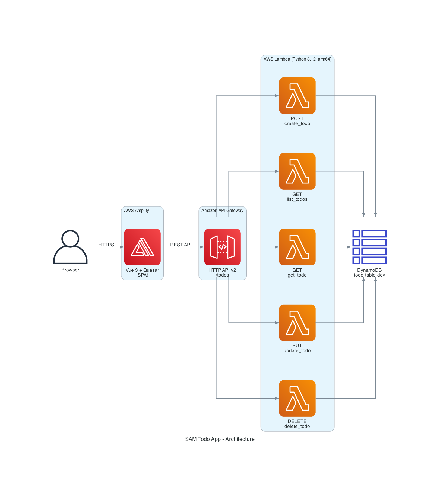
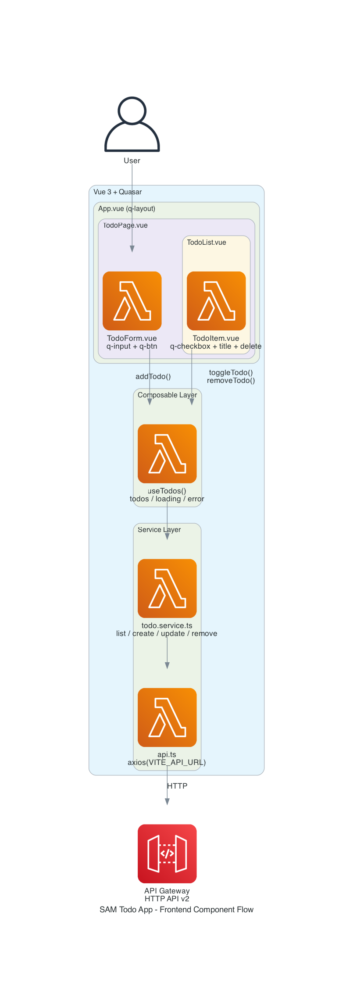
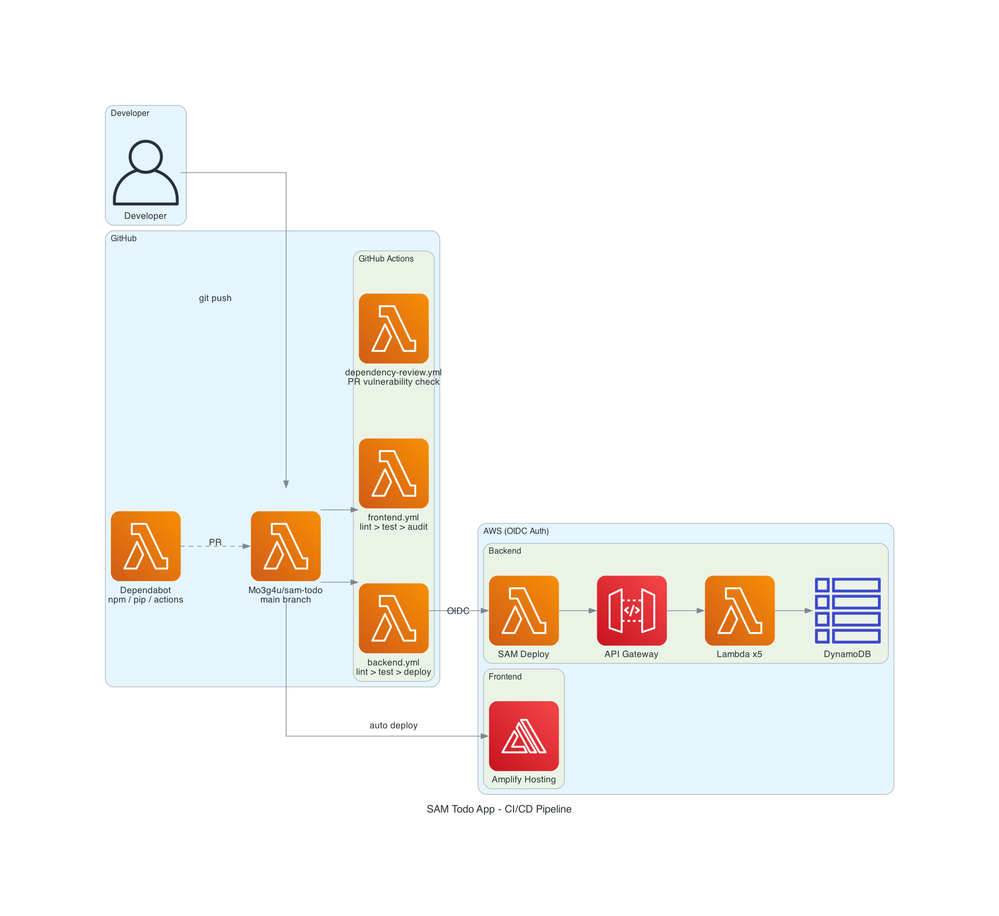

# SAM Todo App アーキテクチャドキュメント

## 1. システム全体構成



| レイヤー | 技術 | 役割 |
|---|---|---|
| フロントエンド | Vue 3 + Quasar v2 (TypeScript) | SPA、ユーザー操作 |
| ホスティング | AWS Amplify Gen2 | フロントエンド配信、自動デプロイ |
| API | Amazon API Gateway HTTP API v2 | REST エンドポイント、CORS プリフライト |
| コンピュート | AWS Lambda (Python 3.12, arm64) | CRUD ビジネスロジック + CORS ヘッダー |
| データベース | Amazon DynamoDB (オンデマンド) | Todo データ永続化 |
| IaC | AWS SAM | インフラ定義・デプロイ |

---

## 2. バックエンド処理フロー

### 2.1 リクエストの流れ

```
Browser → API Gateway (HTTP API v2) → Lambda Handler → DynamoDB
                                           ↓
                                     shared/dynamo_helper.py   (テーブル接続)
                                     shared/models.py          (データ生成)
                                     shared/response_builder.py (レスポンス + CORS)
```

### 2.2 エンドポイントと処理内容

| メソッド | パス | ハンドラー | 処理 |
|---|---|---|---|
| POST | `/todos` | `create_todo.handler` | JSON body から `title` 取得 → UUID 生成 → `put_item` → 201 |
| GET | `/todos` | `list_todos.handler` | `scan` → PK 除去 → `created_at` 降順ソート → 200 |
| GET | `/todos/{id}` | `get_todo.handler` | `get_item(PK=TODO#{id})` → 200 / 404 |
| PUT | `/todos/{id}` | `update_todo.handler` | 存在確認 → 動的 `UpdateExpression` 構築 → `update_item` → 200 / 404 |
| DELETE | `/todos/{id}` | `delete_todo.handler` | `delete_item(PK=TODO#{id})` → 204 |

### 2.3 共通モジュール (shared/)

```
shared/
├── dynamo_helper.py    テーブルリソースのシングルトン取得
│                       DYNAMODB_ENDPOINT → ローカル接続 (ダミー認証)
│                       未設定 → AWS マネージド接続
│
├── models.py           create_todo_item(title) → Todo dict 生成
│                       UUID v4, PK="TODO#<uuid>", ISO 8601 タイムスタンプ
│
└── response_builder.py success(body, status=200) → API Gateway レスポンス
                        error(message, status=400)
                        全レスポンスに CORS ヘッダー付与 (ALLOWED_ORIGINS env var)
                        Decimal → float 変換の JSON エンコーダー内蔵
```

### 2.4 DynamoDB テーブル設計

```
テーブル名: todo-table-dev
キー:      PK (String) = "TODO#<uuid>"

属性:
  PK          "TODO#<uuid>"       ← パーティションキー (API レスポンスからは除去)
  id          "<uuid>"            ← API レスポンス用
  title       "買い物に行く"
  completed   false
  created_at  "2026-04-10T12:00:00Z"
  updated_at  "2026-04-10T12:00:00Z"
```

- GSI なし (MVP、小規模のため Scan で十分)
- BillingMode: PAY_PER_REQUEST (オンデマンド)

### 2.5 CORS ヘッダー

Lambda レスポンスに直接 CORS ヘッダーを含める方式:

```python
# response_builder.py
{
    "Access-Control-Allow-Origin": os.environ.get("ALLOWED_ORIGINS", "http://localhost:9000"),
    "Access-Control-Allow-Headers": "Content-Type",
    "Access-Control-Allow-Methods": "GET,POST,PUT,DELETE,OPTIONS"
}
```

OPTIONS プリフライトは `template-deploy.yaml` の `x-amazon-apigateway-cors` で API Gateway が自動処理。

### 2.6 エラーハンドリング

全ハンドラーに try/except を設置。DynamoDB 接続エラー等の未処理例外は `500` で返す。

### 2.7 SAM テンプレート分離

| テンプレート | 用途 | 理由 |
|---|---|---|
| `template.yaml` | ローカル開発 | SAM Events で自動ルーティング。`sam local start-api` 互換 |
| `template-deploy.yaml` | AWS デプロイ | OpenAPI DefinitionBody + IAM ロール。Control Tower CT.LAMBDA.PV.2 回避 |

Control Tower の SCP が `lambda:AddPermission` をブロックするため、SAM Events の自動生成する `AWS::Lambda::Permission` は使えない。代わりに `ApiGatewayInvokeRole` (IAM ロール) で API Gateway が Lambda を呼び出す。詳細は [Control Tower 対応の解説](control-tower-lambda-permission.md) を参照。

---

## 3. フロントエンド処理フロー



### 3.1 コンポーネント構成

```
App.vue                     ← q-layout + q-header + q-page-container
└── router-view
    └── TodoPage.vue        ← useTodos() composable でデータ管理
        ├── TodoForm.vue    ← q-input + q-btn (追加ボタン)
        └── TodoList.vue    ← q-spinner / 空メッセージ / q-list
            └── TodoItem.vue ← q-checkbox + タイトル + 削除ボタン (×N)
```

### 3.2 データフロー

```
[ユーザー操作]
    ↓
TodoForm / TodoItem          ← emit('add', title) / emit('toggle', todo) / emit('remove', id)
    ↓
TodoPage.vue                 ← イベントを composable の関数に接続
    ↓
useTodos() composable        ← リアクティブ state: todos, loading, error
    ↓                          関数: fetchTodos, addTodo, toggleTodo, removeTodo
todoService                  ← list(), create(), update(), remove()
    ↓
api.ts (axios)               ← baseURL: VITE_API_URL
    ↓
API Gateway → Lambda → DynamoDB
```

### 3.3 状態管理 (useTodos composable)

| 状態 | 型 | 用途 |
|---|---|---|
| `todos` | `Ref<Todo[]>` | Todo 一覧 |
| `loading` | `Ref<boolean>` | API 通信中フラグ |
| `error` | `Ref<string \| null>` | エラーメッセージ (日本語) |

| 関数 | 処理 |
|---|---|
| `fetchTodos()` | `todoService.list()` → `todos` に格納 |
| `addTodo(title)` | `todoService.create({title})` → `todos` の先頭に追加 |
| `toggleTodo(todo)` | `todoService.update(id, {completed: !completed})` → 該当要素を差し替え |
| `removeTodo(id)` | `todoService.remove(id)` → `todos` からフィルター除去 |

---

## 4. ローカル開発環境

```
┌─────────────────┐    ┌──────────────────────┐    ┌─────────────────────┐
│ Quasar Dev       │    │ SAM Local API        │    │ DynamoDB Local      │
│ localhost:9000   │───→│ localhost:3000        │───→│ localhost:8000      │
│ (HMR)           │    │ (Docker + Lambda)     │    │ (Docker, in-memory) │
└─────────────────┘    └──────────────────────┘    └─────────────────────┘
```

### 起動コマンド

```bash
make dev-backend     # DynamoDB Local 起動 → テーブル作成 → sam build → sam local start-api
make dev-frontend    # Quasar dev server (port 9000)
```

### ポイント

- `backend/env.json` で `DYNAMODB_ENDPOINT=http://host.docker.internal:8000` を Lambda コンテナに渡す
- `dynamo_helper.py` が `DYNAMODB_ENDPOINT` 環境変数を検出するとローカル接続 (ダミー認証) に切り替え
- DynamoDB Local は in-memory モード (`-inMemory`) のため、再起動するとデータが消える
- テーブル作成は `scripts/create-table.sh` で自動実行

---

## 5. CI/CD パイプライン



### 5.1 ワークフロー一覧

| ワークフロー | トリガー | 処理 |
|---|---|---|
| `backend.yml` | `backend/**` への push/PR, 手動 | Ruff lint → pytest → (main のみ) SAM deploy |
| `frontend.yml` | `frontend/**` への push/PR | ESLint → Prettier → Vitest → npm audit → audit signatures |
| `dependency-review.yml` | 全 PR | 脆弱性 (high+) + 禁止ライセンス (GPL/AGPL) チェック |

### 5.2 デプロイフロー

```
Developer
  │
  ├─ git push (backend/**)
  │   └─ GitHub Actions (backend.yml)
  │       ├─ test job: ruff check → ruff format → pytest
  │       └─ deploy job (main only):
  │           ├─ OIDC で AWS AssumeRole
  │           ├─ sam build --template-file template-deploy.yaml
  │           ├─ ROLLBACK_COMPLETE スタック自動削除
  │           └─ sam deploy → CloudFormation → Lambda + API Gateway + DynamoDB
  │
  └─ git push (frontend/**)
      ├─ GitHub Actions (frontend.yml): lint → test → audit
      └─ Amplify Hosting: nvm install 24 → npm ci → npm run build → 自動デプロイ
```

### 5.3 AWS 認証

- GitHub → AWS 間は **OIDC** (OpenID Connect) で認証
- 長期 Access Key は使用しない
- IAM ロール: `github-actions-sam-todo` (Mo3g4u/sam-todo の main ブランチのみ AssumeRole 可能)
- GitHub Secrets: `AWS_ROLE_ARN`, `FRONTEND_URL`

### 5.4 Control Tower 対応

`template-deploy.yaml` で DefinitionBody + `ApiGatewayInvokeRole` を使用。`lambda:AddPermission` を回避して Control Tower SCP (`CT.LAMBDA.PV.2`) に適合。

---

## 6. サプライチェーン防御

| 防御策 | 内容 |
|---|---|
| Actions SHA ピン留め | 全 Actions をフルレングスコミット SHA で固定 |
| Dependabot | npm / pip / github-actions の週次自動更新 PR |
| Dependency Review | PR 時に high 以上の脆弱性 + GPL/AGPL ライセンスを拒否 |
| npm audit | CI で `npm audit --audit-level=high` 実行 |
| audit signatures | `npm audit signatures` でパッケージ真正性検証 |
| ignore-scripts | `.npmrc` で `ignore-scripts=true`、postinstall 攻撃を防止 |

---

## 7. テスト戦略

### バックエンド (pytest + moto) — 27 テスト

```
tests/
├── conftest.py                 ← dynamo_table fixture (mock AWS DynamoDB)
└── unit/
    ├── handlers/               ← Lambda ハンドラーの CRUD テスト (12)
    └── shared/                 ← 共通ユーティリティのテスト (15)
```

### フロントエンド (Vitest + happy-dom) — 10 テスト

```
tests/unit/
├── services/
│   └── todo.service.test.ts    ← axios を mock して 5 メソッドをテスト
└── composables/
    └── useTodos.test.ts        ← todoService を mock して状態管理をテスト
```

### E2E (Playwright)

```
e2e/
└── todo_app.py                 ← ブラウザで CRUD 全操作を自動テスト
```
