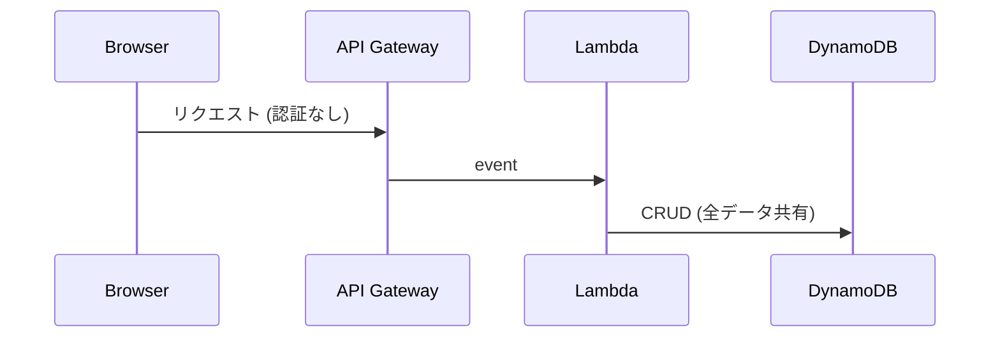
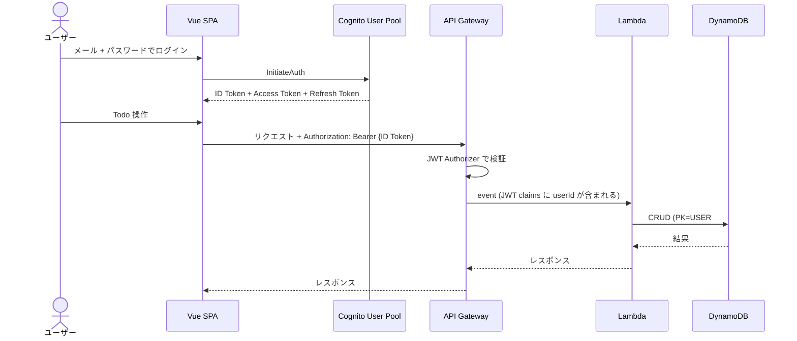

# 認証機能 設計ドキュメント

## 概要

Amazon Cognito を使ったメールアドレス + パスワード認証を追加し、ユーザーごとに Todo データを分離する。

### ゴール

- メールアドレス + パスワードでサインアップ / ログイン
- メール確認 (Cognito の検証コード)
- ログイン済みユーザーのみ Todo 操作可能
- 各ユーザーは自分の Todo のみ参照・操作可能

### スコープ外 (今回は実装しない)

- ソーシャルログイン (Google, GitHub 等)
- パスワードリセット UI (Cognito のデフォルト機能は有効にするが、専用 UI は作らない)
- 管理者機能

---

## 1. アーキテクチャ変更

### 現状



### 認証導入後



---

## 2. Cognito User Pool 設定

### SAM テンプレートに追加するリソース

```yaml
TodoUserPool:
  Type: AWS::Cognito::UserPool
  Properties:
    UserPoolName: todo-user-pool
    # メールアドレスをユーザー名として使用
    UsernameAttributes:
      - email
    AutoVerifiedAttributes:
      - email
    # パスワードポリシー
    Policies:
      PasswordPolicy:
        MinimumLength: 8
        RequireLowercase: true
        RequireUppercase: true
        RequireNumbers: true
        RequireSymbols: false
    # メール検証メッセージ
    VerificationMessageTemplate:
      DefaultEmailOption: CONFIRM_WITH_CODE
    Schema:
      - Name: email
        Required: true
        Mutable: true

TodoUserPoolClient:
  Type: AWS::Cognito::UserPoolClient
  Properties:
    UserPoolId: !Ref TodoUserPool
    ClientName: todo-app-client
    # サーバーサイドシークレットなし (SPA から直接使うため)
    GenerateSecret: false
    ExplicitAuthFlows:
      - ALLOW_USER_SRP_AUTH        # SRP プロトコルでパスワード認証
      - ALLOW_REFRESH_TOKEN_AUTH   # トークンリフレッシュ
    # トークン有効期限
    AccessTokenValidity: 1       # 1時間
    IdTokenValidity: 1           # 1時間
    RefreshTokenValidity: 30     # 30日
    TokenValidityUnits:
      AccessToken: hours
      IdToken: hours
      RefreshToken: days
```

### API Gateway JWT Authorizer

```yaml
TodoApi:
  Type: AWS::Serverless::HttpApi
  Properties:
    Auth:
      DefaultAuthorizer: CognitoAuthorizer
      Authorizers:
        CognitoAuthorizer:
          AuthorizationScopes:
            - openid
          IdentitySource: $request.header.Authorization
          JwtConfiguration:
            issuer: !Sub https://cognito-idp.${AWS::Region}.amazonaws.com/${TodoUserPool}
            audience:
              - !Ref TodoUserPoolClient
```

---

## 3. DynamoDB テーブル再設計

### 現状 (単一キー)

```
PK = "TODO#<uuid>"     ← 全ユーザーのデータが混在
```

### 認証導入後 (複合キー)

```
PK = "USER#<userId>"   ← Cognito の sub (ユーザー固有 ID)
SK = "TODO#<uuid>"     ← Sort Key で Todo を区別
```

#### テーブル定義の変更

```yaml
TodoTable:
  Type: AWS::DynamoDB::Table
  Properties:
    TableName: todo-table-dev
    BillingMode: PAY_PER_REQUEST
    AttributeDefinitions:
      - AttributeName: PK
        AttributeType: S
      - AttributeName: SK       # ← 追加
        AttributeType: S
    KeySchema:
      - AttributeName: PK
        KeyType: HASH
      - AttributeName: SK       # ← 追加
        KeyType: RANGE
```

#### データ例

```
PK                                    SK                  id          title          completed
USER#a1b2c3d4-xxxx-xxxx-xxxx         TODO#f1e2d3c4-...   f1e2d3c4..  買い物に行く    false
USER#a1b2c3d4-xxxx-xxxx-xxxx         TODO#a9b8c7d6-...   a9b8c7d6..  本を読む        true
USER#z9y8x7w6-xxxx-xxxx-xxxx         TODO#m1n2o3p4-...   m1n2o3p4..  会議の準備      false
```

**ポイント**: 同じ PK (ユーザー) 配下の Todo は `Query(PK=USER#xxx)` で効率的に取得できます。`Scan` は不要になります。

---

## 4. バックエンド変更

### 4.1 Lambda ハンドラーの変更点

**JWT からユーザー ID を取得**:

API Gateway の JWT Authorizer が検証済みトークンの claims を `event` に含めて Lambda に渡します:

```python
# event["requestContext"]["authorizer"]["jwt"]["claims"]["sub"]
# → Cognito ユーザーの一意な ID (UUID 形式)
```

これを共通ヘルパーとして抽出:

```python
# shared/auth.py (新規)
def get_user_id(event: dict) -> str:
    return event["requestContext"]["authorizer"]["jwt"]["claims"]["sub"]
```

### 4.2 各ハンドラーの変更

| ハンドラー | 現状 | 変更後 |
|---|---|---|
| `create_todo` | `PK=TODO#<uuid>` で put_item | `PK=USER#<userId>`, `SK=TODO#<uuid>` で put_item |
| `list_todos` | `scan()` (全件) | `query(PK=USER#<userId>)` (ユーザーの Todo のみ) |
| `get_todo` | `get_item(PK=TODO#<id>)` | `get_item(PK=USER#<userId>, SK=TODO#<id>)` |
| `update_todo` | `get_item + update_item(PK=TODO#<id>)` | `get_item + update_item(PK=USER#<userId>, SK=TODO#<id>)` |
| `delete_todo` | `delete_item(PK=TODO#<id>)` | `delete_item(PK=USER#<userId>, SK=TODO#<id>)` |

### 4.3 models.py の変更

```python
# 現状
def create_todo_item(title: str) -> dict:
    todo_id = str(uuid.uuid4())
    now = datetime.now(timezone.utc).strftime("%Y-%m-%dT%H:%M:%SZ")
    return {
        "PK": f"TODO#{todo_id}",
        "id": todo_id,
        ...
    }

# 変更後
def create_todo_item(user_id: str, title: str) -> dict:
    todo_id = str(uuid.uuid4())
    now = datetime.now(timezone.utc).strftime("%Y-%m-%dT%H:%M:%SZ")
    return {
        "PK": f"USER#{user_id}",
        "SK": f"TODO#{todo_id}",
        "id": todo_id,
        ...
    }
```

---

## 5. フロントエンド変更

### 5.1 認証ライブラリ

`amazon-cognito-identity-js` (AWS 公式の軽量ライブラリ) を使用。

```bash
npm install amazon-cognito-identity-js
```

### 5.2 新規ファイル

| ファイル | 役割 |
|---|---|
| `services/auth.service.ts` | Cognito 認証 (signup, confirm, login, logout, getToken) |
| `composables/useAuth.ts` | 認証状態管理 (user, isAuthenticated, loading) |
| `pages/LoginPage.vue` | ログインフォーム |
| `pages/SignupPage.vue` | サインアップフォーム + 確認コード入力 |
| `router/auth-guard.ts` | 未認証ユーザーをログインページにリダイレクト |

### 5.3 コンポーネント構成 (変更後)

```
App.vue
└── router-view
    ├── LoginPage.vue          ← 新規: ログイン
    ├── SignupPage.vue         ← 新規: サインアップ + メール確認
    └── TodoPage.vue           ← 既存: 認証必須 (auth-guard で保護)
        ├── TodoForm.vue
        └── TodoList.vue
             └── TodoItem.vue
```

### 5.4 ルーティング

```typescript
const routes = [
  { path: '/login', component: LoginPage },
  { path: '/signup', component: SignupPage },
  {
    path: '/',
    component: TodoPage,
    meta: { requiresAuth: true },  // auth-guard で保護
  },
];
```

### 5.5 API リクエストへのトークン付与

`api.ts` の axios インターセプターで ID Token を自動付与:

```typescript
api.interceptors.request.use((config) => {
  const token = authService.getIdToken();
  if (token) {
    config.headers.Authorization = `Bearer ${token}`;
  }
  return config;
});
```

### 5.6 認証フロー

**サインアップ**:
```
1. メール + パスワード入力 → Cognito signUp
2. メールに確認コード送信
3. 確認コード入力 → Cognito confirmSignUp
4. ログインページにリダイレクト
```

**ログイン**:
```
1. メール + パスワード入力 → Cognito initiateAuth (SRP)
2. ID Token + Access Token + Refresh Token を取得
3. localStorage に保存
4. TodoPage にリダイレクト
```

**トークンリフレッシュ**:
```
- axios インターセプターで 401 レスポンスを検知
- Refresh Token で新しい ID Token を取得
- 失敗したリクエストをリトライ
- Refresh Token も期限切れならログインページにリダイレクト
```

---

## 6. 環境変数の追加

### バックエンド (SAM テンプレート)

| 変数 | 値 |
|---|---|
| `USER_POOL_ID` | `!Ref TodoUserPool` |
| `USER_POOL_CLIENT_ID` | `!Ref TodoUserPoolClient` |

### フロントエンド (.env)

| 変数 | 値 |
|---|---|
| `VITE_COGNITO_USER_POOL_ID` | デプロイ後に取得 |
| `VITE_COGNITO_CLIENT_ID` | デプロイ後に取得 |
| `VITE_COGNITO_REGION` | `ap-northeast-1` |

---

## 7. マイグレーション

既存データの移行が必要です。

### 現状のデータ

```
PK = "TODO#<uuid>"  (SK なし)
```

### 移行方法

1. 既存テーブルのデータは認証なしで作成されたものなので、**既存データは破棄** (MVP なので問題なし)
2. テーブルを再作成 (CloudFormation スタック更新で PK + SK に変更)

**注意**: PK + SK へのキースキーマ変更はテーブルの置換 (削除 + 再作成) になるため、既存データは失われます。

---

## 8. テスト方針

### バックエンド

- テスト用に JWT claims をモックした `event` を作成
- `get_user_id()` のテスト
- 各ハンドラーが `PK=USER#xxx`, `SK=TODO#xxx` で正しく CRUD するかテスト
- 他ユーザーのデータにアクセスできないことを検証

### フロントエンド

- `auth.service.ts` のテスト (Cognito SDK をモック)
- `useAuth()` composable のテスト
- ルーターの auth-guard テスト
- `api.ts` インターセプターのテスト (トークン付与)

---

## 9. 実装順序

| # | タスク | テンプレート |
|---|---|---|
| 1 | SAM テンプレートに Cognito リソース追加 | template.yaml, template-deploy.yaml |
| 2 | DynamoDB テーブルを PK + SK に変更 | template.yaml, template-deploy.yaml |
| 3 | `shared/auth.py` 作成 (TDD) | — |
| 4 | `shared/models.py` を user_id 対応に変更 (TDD) | — |
| 5 | 全ハンドラーを user_id 対応に変更 (TDD) | — |
| 6 | API Gateway に JWT Authorizer 設定 | template.yaml, template-deploy.yaml |
| 7 | フロントエンド: `auth.service.ts` + `useAuth()` (TDD) | — |
| 8 | フロントエンド: LoginPage + SignupPage 作成 | — |
| 9 | フロントエンド: auth-guard + axios インターセプター | — |
| 10 | フロントエンド: 環境変数設定 + Amplify 再デプロイ | amplify.yml |
| 11 | E2E テスト更新 | — |
